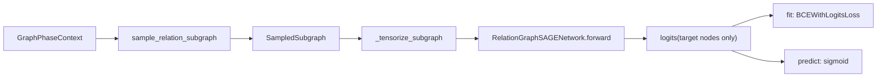

# gnn_models.py 代码讲解

本文档对应源码文件 [gnn_models.py](./gnn_models.py)，目标是把当前项目里的 GNN 实现讲清楚。结构固定分成两层：

1. 按函数逐行代码讲解
2. 按执行流程讲解训练和推理

这份说明针对当前仓库里的实际实现，不是泛泛而谈的 GraphSAGE 教程。

## 0. 先回答：fanout 是什么

`fanout` 指的是子图采样时，每一跳、每个中心节点，最多保留多少条邻边。

在本实现里：

- 采样函数是 `_sample_edge_indices(...)`
- 采样方式是 `uniform random sampling without replacement`
- 也就是“均匀随机、无放回采样”
- 如果是时间模型，还会先过滤掉 `snapshot_end` 之后的未来边，再在剩下的合法边里采样

当前实现里，`sample_relation_subgraph(...)` 对每个中心节点会分别处理：

- 入边
- 出边

因此如果某一跳的 `fanout = 15`，那它的真实含义不是“总共 15 条边”，而是：

- 最多采 15 条入边
- 最多采 15 条出边

所以每个中心节点在这一跳最多可能带来约 `30` 条消息边。

如果 `fanouts = [15, 10]`，表示：

- 第 1 跳：每个种子节点最多采 `15` 条入边和 `15` 条出边
- 第 2 跳：对第一跳扩出来的 frontier 节点，再各自最多采 `10` 条入边和 `10` 条出边

它解决的是两个问题：

- 全图太大，不能每个 batch 都把整张图送进模型
- 高度节点如果不截断，训练会被少数大节点拖垮

## 1. 文件整体结构

`gnn_models.py` 实际上不是“一个模型类”，而是 4 层结构：

1. 图上下文和子图容器
2. 子图采样
3. 单层关系消息传递与多层网络
4. 训练、预测、保存、加载包装器

可以先按这个图理解：



## 2. 按函数逐行代码讲解

---

### 2.1 `GraphPhaseContext`

源码位置：

- [gnn_models.py:19](./gnn_models.py#L19)

代码：

```python
@dataclass(frozen=True)
class GraphPhaseContext:
    phase: str
    feature_store: FeatureStore
    graph_cache: GraphCache
    labels: np.ndarray
```

逐行讲解：

- `@dataclass(frozen=True)`：把这个类定义成不可变数据类。这里的意思是“它只是一个上下文包”，不希望训练过程中被随手改掉字段。
- `phase`：当前数据阶段，通常是 `phase1` 或 `phase2`。
- `feature_store`：节点特征读取器。它负责根据节点 id 取出模型输入特征。
- `graph_cache`：图结构缓存。里面有 CSR 风格的入边、出边索引和时间信息。
- `labels`：整个 phase 的节点标签数组。

它的作用是把原本分散的 4 个输入统一成一个对象，后面的 `fit(...)` 和 `predict_proba(...)` 就只需要传一个 `context`。

### 2.2 `SampledSubgraph`

源码位置：

- [gnn_models.py:27](./gnn_models.py#L27)

代码：

```python
@dataclass(frozen=True)
class SampledSubgraph:
    node_ids: np.ndarray
    edge_src: np.ndarray
    edge_dst: np.ndarray
    rel_ids: np.ndarray
    edge_timestamp: np.ndarray
    target_local_idx: np.ndarray
```

逐行讲解：

- `node_ids`：当前采样子图中包含的所有节点，全局节点 id。
- `edge_src`：子图里每条边的源节点局部编号。
- `edge_dst`：子图里每条边的目标节点局部编号。
- `rel_ids`：每条边对应的关系类型 id。
- `edge_timestamp`：每条边的时间戳。
- `target_local_idx`：本 batch 种子节点在 `node_ids` 这个局部节点表中的位置。

这里最重要的是“局部编号”这个概念。模型前向时不直接拿全图 id 做索引，而是先把一个小子图压成从 `0` 开始的局部连续编号。

### 2.3 `_sample_edge_indices(...)`

源码位置：

- [gnn_models.py:37](./gnn_models.py#L37)

代码：

```python
def _sample_edge_indices(
    edge_timestamp: np.ndarray,
    fanout: int,
    rng: np.random.Generator,
    snapshot_end: int | None,
) -> np.ndarray:
    if edge_timestamp.size == 0:
        return np.empty(0, dtype=np.int32)
    if snapshot_end is not None:
        valid = np.flatnonzero(edge_timestamp <= snapshot_end)
    else:
        valid = np.arange(edge_timestamp.size, dtype=np.int32)
    if valid.size <= fanout:
        return valid.astype(np.int32, copy=False)
    choice = rng.choice(valid, size=fanout, replace=False)
    return np.sort(choice.astype(np.int32, copy=False))
```

逐行讲解：

- `edge_timestamp`：传进来的是某个中心节点那一小段边的时间数组，不是全图时间。
- `fanout`：最多保留多少条。
- `rng`：NumPy 随机数生成器，保证采样可复现。
- `snapshot_end`：如果是时间模型，这里代表当前快照时间上界。
- `if edge_timestamp.size == 0`：如果这个节点没有这类边，直接返回空索引。
- `if snapshot_end is not None`：时间模型分支。
- `np.flatnonzero(edge_timestamp <= snapshot_end)`：只保留快照之前发生的边，防止时间泄漏。
- `else`：静态模型分支，所有边都合法。
- `if valid.size <= fanout`：如果合法边本来就不多，那就全保留。
- `rng.choice(valid, size=fanout, replace=False)`：如果合法边很多，就随机无放回采样 `fanout` 条。
- `np.sort(...)`：最后排序返回，让输出索引更稳定。

这段代码的输入输出是：

```text
一个中心节点的一段边时间数组
-> 过滤未来边
-> 随机无放回采样
-> 返回局部边下标
```

### 2.4 `sample_relation_subgraph(...)`

源码位置：

- [gnn_models.py:55](./gnn_models.py#L55)

这是整份文件里最关键的函数之一。它负责“从种子节点开始，采样一个带方向、带关系、可选带时间约束的局部子图”。

代码主干：

```python
def sample_relation_subgraph(
    graph: GraphCache,
    seed_nodes: np.ndarray,
    fanouts: list[int],
    rng: np.random.Generator,
    snapshot_end: int | None = None,
) -> SampledSubgraph:
    seeds = np.asarray(seed_nodes, dtype=np.int32)
    ordered_nodes: list[int] = []
    seen_nodes: set[int] = set()

    def add_nodes(nodes: np.ndarray) -> None:
        for node in nodes.tolist():
            if node not in seen_nodes:
                seen_nodes.add(node)
                ordered_nodes.append(int(node))

    add_nodes(seeds)
    frontier = seeds
    edge_records: list[tuple[int, int, int, int]] = []
    ...
```

#### 第 1 段：初始化

- `seeds = np.asarray(...)`：把种子节点转换成统一 dtype。
- `ordered_nodes`：子图节点表，保存加入顺序。
- `seen_nodes`：配合 `ordered_nodes` 去重。
- `add_nodes(...)`：内部辅助函数，用来把一批节点加入子图节点表。
- `add_nodes(seeds)`：先把种子节点加入子图。
- `frontier = seeds`：第一跳就从种子节点开始扩展。
- `edge_records`：临时保存采样到的边，格式是 `(src, dst, rel_id, timestamp)`。

这一段做完之后，状态是：

```text
seed_nodes -> 子图节点表的初始集合
```

#### 第 2 段：按 hop 扩展

核心循环：

```python
for fanout in fanouts:
    if frontier.size == 0:
        break
    next_frontier: list[np.ndarray] = []
    for center in frontier.tolist():
        ...
```

逐行讲解：

- `for fanout in fanouts`：按 hop 循环。比如 `[15, 10]` 就是两跳。
- `if frontier.size == 0`：如果上一跳已经没有新节点可扩了，就提前结束。
- `next_frontier`：下一跳的中心节点集合。
- `for center in frontier.tolist()`：枚举当前 hop 的每个中心节点。

#### 第 3 段：采入边

对应代码：

```python
in_start = int(graph.in_ptr[center])
in_end = int(graph.in_ptr[center + 1])
in_choice = _sample_edge_indices(
    edge_timestamp=np.asarray(graph.in_edge_timestamp[in_start:in_end]),
    fanout=fanout,
    rng=rng,
    snapshot_end=snapshot_end,
)
if in_choice.size:
    in_neighbors = np.asarray(graph.in_neighbors[in_start:in_end])[in_choice]
    in_type = np.asarray(graph.in_edge_type[in_start:in_end])[in_choice]
    in_time = np.asarray(graph.in_edge_timestamp[in_start:in_end])[in_choice]
    next_frontier.append(in_neighbors.astype(np.int32, copy=False))
    add_nodes(in_neighbors.astype(np.int32, copy=False))
    edge_records.extend(
        (
            int(src),
            int(center),
            int(edge_type - 1),
            int(edge_time),
        )
        for src, edge_type, edge_time in zip(...)
    )
```

逐行讲解：

- `graph.in_ptr[center]` 到 `graph.in_ptr[center + 1]`：取出这个节点在入边数组里的区间。
- `graph.in_edge_timestamp[in_start:in_end]`：取该区间的时间戳。
- `_sample_edge_indices(...)`：在这些入边中做时间过滤和随机采样。
- `if in_choice.size`：如果确实采到了边。
- `in_neighbors`：这些入边的源节点，也就是“谁指向了 center”。
- `in_type`：这些边的类型。
- `in_time`：这些边的时间。
- `next_frontier.append(...)`：这些入邻居会成为下一跳的候选中心节点。
- `add_nodes(...)`：把入邻居加入子图节点集合。
- `edge_records.extend(...)`：把这些边记成 `(src, center, rel_id, time)`。
- `edge_type - 1`：把原始边类型 `1..11` 转成 embedding 索引 `0..10`。

这里的设计意图很直接：

- 入边天然就是“邻居 -> 当前中心”
- 所以可以直接当消息传递边来用

#### 第 4 段：采出边

对应代码：

```python
out_start = int(graph.out_ptr[center])
out_end = int(graph.out_ptr[center + 1])
out_choice = _sample_edge_indices(
    edge_timestamp=np.asarray(graph.out_edge_timestamp[out_start:out_end]),
    fanout=fanout,
    rng=rng,
    snapshot_end=snapshot_end,
)
if out_choice.size:
    out_neighbors = np.asarray(graph.out_neighbors[out_start:out_end])[out_choice]
    out_type = np.asarray(graph.out_edge_type[out_start:out_end])[out_choice]
    out_time = np.asarray(graph.out_edge_timestamp[out_start:out_end])[out_choice]
    next_frontier.append(out_neighbors.astype(np.int32, copy=False))
    add_nodes(out_neighbors.astype(np.int32, copy=False))
    edge_records.extend(
        (
            int(src),
            int(center),
            int(edge_type - 1 + graph.num_edge_types),
            int(edge_time),
        )
        for src, edge_type, edge_time in zip(...)
    )
```

逐行讲解：

- `graph.out_ptr[...]`：取出当前中心节点的出边区间。
- `_sample_edge_indices(...)`：对这段出边也做同样采样。
- `out_neighbors`：这些出边的目标节点，也就是 `center -> out_neighbor` 里的 `out_neighbor`。
- `next_frontier.append(...)`：这些出邻居同样要成为下一跳的候选中心节点。
- `add_nodes(...)`：把这些出邻居也加入子图。
- 最关键的是 `edge_records.extend(...)` 这段。

这里虽然原始边方向是：

```text
center -> out_neighbor
```

但记录时写成了：

```text
src = out_neighbor
dst = center
rel_id = edge_type - 1 + graph.num_edge_types
```

也就是说，代码把“出边邻居”也翻译成了“邻居给中心节点发消息”，只是通过关系 id 偏移来保留“它原本是一条出边”这件事。

于是当前实现的关系编号是：

- 原始入边类型：`0..10`
- 原始出边类型：`11..21`

这就是“方向性感知”的实现方式。

#### 第 5 段：更新下一跳 frontier

对应代码：

```python
if next_frontier:
    frontier = np.unique(np.concatenate(next_frontier)).astype(np.int32, copy=False)
else:
    frontier = np.empty(0, dtype=np.int32)
```

逐行讲解：

- 如果当前 hop 采到了新邻居，就拼起来、去重，作为下一跳 frontier。
- 如果没采到，就把 frontier 设为空，下一个 hop 会直接结束。

#### 第 6 段：构造局部子图编号

对应代码：

```python
node_ids = np.asarray(ordered_nodes, dtype=np.int32)
global_to_local = {int(node): idx for idx, node in enumerate(node_ids.tolist())}
target_local_idx = np.asarray([global_to_local[int(node)] for node in seeds.tolist()], dtype=np.int64)
```

逐行讲解：

- `node_ids`：最终子图中的全局节点 id 列表。
- `global_to_local`：把全局节点 id 映射到子图局部编号。
- `target_local_idx`：种子节点在子图局部编号里的位置。

这里的意义是：

- 模型前向只认识局部编号
- 但最终只对种子节点位置输出 logits

#### 第 7 段：拆出局部边数组

对应代码：

```python
if edge_records:
    edge_src = np.asarray([global_to_local[src] for src, _, _, _ in edge_records], dtype=np.int64)
    edge_dst = np.asarray([global_to_local[dst] for _, dst, _, _ in edge_records], dtype=np.int64)
    rel_ids = np.asarray([rel for _, _, rel, _ in edge_records], dtype=np.int64)
    edge_timestamp = np.asarray([ts for _, _, _, ts in edge_records], dtype=np.int64)
else:
    edge_src = np.empty(0, dtype=np.int64)
    edge_dst = np.empty(0, dtype=np.int64)
    rel_ids = np.empty(0, dtype=np.int64)
    edge_timestamp = np.empty(0, dtype=np.int64)
```

逐行讲解：

- 如果采到了边，就把临时边记录拆成 4 个数组。
- `edge_src`、`edge_dst` 不再是全局 id，而是局部编号。
- 如果没有边，返回空数组，后面的 GNN 层会自动退化成只用 self feature。

#### 第 8 段：返回 `SampledSubgraph`

```python
return SampledSubgraph(
    node_ids=node_ids,
    edge_src=edge_src,
    edge_dst=edge_dst,
    rel_ids=rel_ids,
    edge_timestamp=edge_timestamp,
    target_local_idx=target_local_idx,
)
```

最终输出是：

```text
全局种子节点
-> 采样得到局部节点集合
-> 采样得到局部边集合
-> 记录种子节点在局部图里的位置
-> 返回 SampledSubgraph
```

### 2.5 `TimeEncoder`

源码位置：

- [gnn_models.py:166](./gnn_models.py#L166)

代码：

```python
class TimeEncoder(nn.Module):
    def __init__(self, out_dim: int) -> None:
        super().__init__()
        self.net = nn.Sequential(
            nn.Linear(1, out_dim),
            nn.ReLU(),
            nn.Linear(out_dim, out_dim),
        )

    def forward(self, relative_time: torch.Tensor) -> torch.Tensor:
        return self.net(relative_time)
```

逐行讲解：

- 这是一个很轻量的时间编码器，不是复杂的时序模块。
- `nn.Linear(1, out_dim)`：输入是 1 维相对时间。
- `ReLU()`：非线性。
- 第二层 `Linear(out_dim, out_dim)`：把时间映射到和关系 embedding 同维的空间。
- `forward(...)`：直接把输入时间张量送入这段 MLP。

注意这里编码的不是绝对日期，而是后面 `_tensorize_subgraph(...)` 生成的“相对当前快照的边龄”。

### 2.6 `RelationSAGELayer.__init__(...)`

源码位置：

- [gnn_models.py:179](./gnn_models.py#L179)

代码：

```python
class RelationSAGELayer(nn.Module):
    def __init__(
        self,
        in_dim: int,
        out_dim: int,
        num_relations: int,
        rel_dim: int,
        time_dim: int = 0,
    ) -> None:
        super().__init__()
        self.relation_embedding = nn.Embedding(num_relations, rel_dim)
        msg_in_dim = in_dim + rel_dim + time_dim
        self.msg_linear = nn.Linear(msg_in_dim, out_dim)
        self.self_linear = nn.Linear(in_dim, out_dim)
        self.neigh_linear = nn.Linear(out_dim, out_dim)
```

逐行讲解：

- `relation_embedding`：每种关系一个 embedding。
- `msg_in_dim = in_dim + rel_dim + time_dim`：消息输入由 3 部分组成。
  - 源节点特征
  - 关系 embedding
  - 时间编码（可选）
- `msg_linear`：把拼接后的消息输入映射成真正的消息向量。
- `self_linear`：中心节点自己的特征变换。
- `neigh_linear`：邻居聚合结果的变换。

这一层的思想是：

```text
self path + neighbor message path
```

### 2.7 `RelationSAGELayer.forward(...)`

源码位置：

- [gnn_models.py:195](./gnn_models.py#L195)

代码：

```python
def forward(
    self,
    x: torch.Tensor,
    edge_src: torch.Tensor,
    edge_dst: torch.Tensor,
    rel_ids: torch.Tensor,
    time_feature: torch.Tensor | None = None,
) -> torch.Tensor:
    if edge_src.numel() == 0:
        return F.relu(self.self_linear(x))

    relation = self.relation_embedding(rel_ids)
    msg_parts = [x[edge_src], relation]
    if time_feature is not None:
        msg_parts.append(time_feature)
    msg = self.msg_linear(torch.cat(msg_parts, dim=-1))
    agg = x.new_zeros((x.shape[0], msg.shape[1]))
    agg.index_add_(0, edge_dst, msg)
    deg = x.new_zeros((x.shape[0], 1))
    deg.index_add_(
        0,
        edge_dst,
        torch.ones((edge_dst.shape[0], 1), device=x.device, dtype=x.dtype),
    )
    agg = agg / deg.clamp_min(1.0)
    out = self.self_linear(x) + self.neigh_linear(agg)
    return F.relu(out)
```

逐行讲解：

- `x`：子图节点表示，shape 约为 `[num_subgraph_nodes, hidden_dim]`。
- `edge_src`：每条边的源节点局部编号。
- `edge_dst`：每条边的目标节点局部编号。
- `rel_ids`：每条边的关系类型。
- `time_feature`：每条边对应的时间编码，时间模型才会传。

下面看核心逻辑。

- `if edge_src.numel() == 0`：如果当前子图里一条边都没有。
- `return F.relu(self.self_linear(x))`：此时无法聚合邻居，只保留 self path。

如果有边：

- `relation = self.relation_embedding(rel_ids)`：查关系 embedding。
- `msg_parts = [x[edge_src], relation]`：消息的基础组成部分是“源节点表示 + 关系 embedding”。
- `if time_feature is not None`：时间模型再加时间编码。
- `torch.cat(msg_parts, dim=-1)`：沿最后一维拼接。
- `self.msg_linear(...)`：把拼接后的结果变成每条边的消息向量。

接下来是聚合：

- `agg = x.new_zeros((x.shape[0], msg.shape[1]))`：为每个节点准备一个邻居消息累加槽。
- `agg.index_add_(0, edge_dst, msg)`：把所有消息按目标节点加进去。
- `deg = x.new_zeros((x.shape[0], 1))`：准备每个节点收到多少条消息的计数器。
- 再用一次 `deg.index_add_(...)`：按目标节点统计入消息数量。
- `agg = agg / deg.clamp_min(1.0)`：除以计数，得到 mean aggregation。

最后融合：

- `self.self_linear(x)`：self path。
- `self.neigh_linear(agg)`：neighbor path。
- 两者相加后过 `ReLU`。

这层的数学形式可以写成：

```text
msg_e = W_msg [h_src || r_e || t_e]
agg_v = mean(msg_e)
h'_v = ReLU(W_self h_v + W_neigh agg_v)
```

### 2.8 `RelationGraphSAGENetwork.__init__(...)`

源码位置：

- [gnn_models.py:224](./gnn_models.py#L224)

代码：

```python
class RelationGraphSAGENetwork(nn.Module):
    def __init__(
        self,
        input_dim: int,
        hidden_dim: int,
        num_layers: int,
        num_relations: int,
        rel_dim: int,
        dropout: float,
        temporal: bool,
    ) -> None:
        super().__init__()
        self.temporal = temporal
        self.input_proj = nn.Linear(input_dim, hidden_dim)
        self.dropout = nn.Dropout(dropout)
        self.time_encoder = TimeEncoder(rel_dim) if temporal else None
        time_dim = rel_dim if temporal else 0
        self.layers = nn.ModuleList()
        for layer_idx in range(num_layers):
            in_dim = hidden_dim if layer_idx > 0 else hidden_dim
            self.layers.append(
                RelationSAGELayer(
                    in_dim=in_dim,
                    out_dim=hidden_dim,
                    num_relations=num_relations,
                    rel_dim=rel_dim,
                    time_dim=time_dim,
                )
            )
        self.classifier = nn.Sequential(
            nn.Linear(hidden_dim, hidden_dim),
            nn.ReLU(),
            nn.Dropout(dropout),
            nn.Linear(hidden_dim, 1),
        )
```

逐行讲解：

- `input_dim`：节点输入特征维度。
- `hidden_dim`：隐层维度。
- `num_layers`：图层数。
- `num_relations`：关系类型总数。当前实现里通常是 `11 * 2 = 22`。
- `rel_dim`：关系 embedding 维度。
- `temporal`：是否启用时间模型。

关键字段：

- `input_proj`：先把节点输入特征投影到 `hidden_dim`。
- `dropout`：统一的 dropout 模块。
- `time_encoder`：时间模型才创建，否则是 `None`。
- `time_dim`：若启用时间编码，则消息输入会多出 `rel_dim` 维时间特征。
- `self.layers`：按 `num_layers` 堆叠多个 `RelationSAGELayer`。
- `classifier`：最后的节点分类头，输出 1 个 logit。

关于这句：

```python
in_dim = hidden_dim if layer_idx > 0 else hidden_dim
```

它在当前实现里前后是一样的，原因是输入在进入图层前就已经被 `input_proj` 投影到 `hidden_dim` 了，所以每层都接收 `hidden_dim`。

### 2.9 `RelationGraphSAGENetwork.forward(...)`

源码位置：

- [gnn_models.py:260](./gnn_models.py#L260)

代码：

```python
def forward(
    self,
    x: torch.Tensor,
    edge_src: torch.Tensor,
    edge_dst: torch.Tensor,
    rel_ids: torch.Tensor,
    edge_relative_time: torch.Tensor | None,
    target_local_idx: torch.Tensor,
) -> torch.Tensor:
    h = F.relu(self.input_proj(x))
    h = self.dropout(h)
    time_feature = None
    if self.temporal and edge_relative_time is not None and edge_relative_time.numel():
        time_feature = self.time_encoder(edge_relative_time)
    for layer in self.layers:
        h = layer(h, edge_src, edge_dst, rel_ids, time_feature=time_feature)
        h = self.dropout(h)
    return self.classifier(h[target_local_idx]).squeeze(-1)
```

逐行讲解：

- `x`：子图节点输入特征。
- `edge_src`、`edge_dst`、`rel_ids`：子图边描述。
- `edge_relative_time`：可选时间输入。
- `target_local_idx`：哪些子图节点是本 batch 真正要预测的目标节点。

前向流程：

- `h = F.relu(self.input_proj(x))`：先把输入特征投影到隐空间。
- `h = self.dropout(h)`：做一次 dropout。
- `time_feature = None`：默认没有时间信息。
- `if self.temporal ...`：如果启用了时间模式，就对每条边的相对时间编码。
- `for layer in self.layers`：逐层做关系感知图消息传递。
- 每层后再做一次 dropout。
- `h[target_local_idx]`：只取种子节点对应的隐藏表示。
- `self.classifier(...)`：输出二分类 logit。
- `.squeeze(-1)`：把形状从 `[batch_size, 1]` 压成 `[batch_size]`。

最关键的一点是：虽然网络前向吃的是整个子图，但只对 `target_local_idx` 对应的种子节点输出预测结果。其他子图节点只是上下文。

### 2.10 `BaseGraphSAGEExperiment.__init__(...)`

源码位置：

- [gnn_models.py:280](./gnn_models.py#L280)

这部分是“实验包装器”初始化，不是数学核心，但它负责把训练所需配置都装配好。

关键字段逐行解释：

- `self.model_name`：实验名，例如 `m4_graphsage` 或 `m5_temporal_graphsage`。
- `self.seed`：随机种子。
- `self.feature_groups`：输入使用哪些特征组。
- `self.hidden_dim`、`self.num_layers`、`self.rel_dim`：网络结构超参数。
- `self.fanouts`：子图采样每跳的宽度上限。默认为 `[15, 10]`。
- `self.batch_size`：每次训练或预测多少个种子节点。
- `self.epochs`：训练轮数。
- `self.learning_rate`、`self.weight_decay`：优化超参数。
- `self.dropout`：dropout 比例。
- `self.max_day`：该实验使用的全局最大天数，用于时间归一化。
- `self.temporal`：是否启用时间逻辑。
- `self.device = torch.device(resolve_device(device))`：决定跑在 CPU 还是 GPU。
- `self.network = RelationGraphSAGENetwork(...)`：真正创建网络对象。

它做的事情可以概括成：

```text
实验超参数
-> 构造网络
-> 准备训练/推理用环境
```

### 2.11 `_iter_batches(...)`

源码位置：

- [gnn_models.py:326](./gnn_models.py#L326)

代码：

```python
def _iter_batches(
    self,
    context: GraphPhaseContext,
    node_ids: np.ndarray,
    training: bool,
    rng: np.random.Generator,
) -> list[tuple[np.ndarray, np.ndarray, int | None]]:
    nodes = np.asarray(node_ids, dtype=np.int32)
    positions = np.arange(nodes.size, dtype=np.int32)
    if self.temporal:
        buckets = np.asarray(context.graph_cache.node_time_bucket[nodes], dtype=np.int8)
        batches: list[tuple[np.ndarray, np.ndarray, int | None]] = []
        for bucket_idx, window in enumerate(context.graph_cache.time_windows):
            bucket_nodes = nodes[buckets == bucket_idx]
            bucket_positions = positions[buckets == bucket_idx]
            if bucket_nodes.size == 0:
                continue
            if training:
                order = rng.permutation(bucket_nodes.size)
                bucket_nodes = bucket_nodes[order]
                bucket_positions = bucket_positions[order]
            for start in range(0, bucket_nodes.size, self.batch_size):
                batches.append(
                    (
                        bucket_nodes[start : start + self.batch_size],
                        bucket_positions[start : start + self.batch_size],
                        int(window["end_day"]),
                    )
                )
        return batches
    if training:
        order = rng.permutation(nodes.size)
        nodes = nodes[order]
        positions = positions[order]
    return [
        (
            nodes[start : start + self.batch_size],
            positions[start : start + self.batch_size],
            None,
        )
        for start in range(0, nodes.size, self.batch_size)
    ]
```

逐行讲解：

- `nodes`：把输入节点转换成统一格式。
- `positions`：记录这些节点在原输入顺序中的位置。

如果是时间模型：

- `node_time_bucket[nodes]`：查每个节点属于哪个时间桶。
- `batches = []`：准备返回的 batch 列表。
- `for bucket_idx, window in enumerate(...)`：按时间窗口遍历。
- `bucket_nodes = nodes[buckets == bucket_idx]`：挑出当前窗口节点。
- `bucket_positions = positions[...]`：同步保留原顺序位置。
- `if bucket_nodes.size == 0`：空桶跳过。
- `if training`：训练时把这个桶里的节点打乱。
- `for start in range(...)`：按 `batch_size` 切块。
- `int(window["end_day"])`：这个 batch 绑定一个快照结束日 `snapshot_end`。

如果不是时间模型：

- 训练时只对整批节点做随机打乱。
- 每个 batch 的第三项固定是 `None`。

所以这个函数最终返回的不是单独的 `batch_nodes`，而是：

```text
(batch_nodes, batch_positions, snapshot_end)
```

其中：

- `batch_nodes`：这一批要预测的种子节点
- `batch_positions`：这些节点在原输入顺序中的位置
- `snapshot_end`：时间模型的快照上界；静态模型则为 `None`

### 2.12 `_tensorize_subgraph(...)`

源码位置：

- [gnn_models.py:369](./gnn_models.py#L369)

代码：

```python
def _tensorize_subgraph(
    self,
    context: GraphPhaseContext,
    subgraph: SampledSubgraph,
    snapshot_end: int | None,
) -> tuple[torch.Tensor, torch.Tensor, torch.Tensor, torch.Tensor, torch.Tensor | None, torch.Tensor]:
    x_np = context.feature_store.take_rows(subgraph.node_ids)
    x = torch.as_tensor(x_np, dtype=torch.float32, device=self.device)
    edge_src = torch.as_tensor(subgraph.edge_src, dtype=torch.long, device=self.device)
    edge_dst = torch.as_tensor(subgraph.edge_dst, dtype=torch.long, device=self.device)
    rel_ids = torch.as_tensor(subgraph.rel_ids, dtype=torch.long, device=self.device)
    target_idx = torch.as_tensor(subgraph.target_local_idx, dtype=torch.long, device=self.device)
    edge_relative_time = None
    if self.temporal and subgraph.edge_timestamp.size:
        snapshot = snapshot_end if snapshot_end is not None else self.max_day
        relative_time = (snapshot - subgraph.edge_timestamp.astype(np.float32)) / max(self.max_day, 1)
        relative_time = np.clip(relative_time, 0.0, 1.0)
        edge_relative_time = torch.as_tensor(
            relative_time.reshape(-1, 1),
            dtype=torch.float32,
            device=self.device,
        )
    return x, edge_src, edge_dst, rel_ids, edge_relative_time, target_idx
```

逐行讲解：

- `context.feature_store.take_rows(subgraph.node_ids)`：取出子图节点的输入特征。
- `torch.as_tensor(...)`：把 NumPy 数组转成当前设备上的张量。
- `edge_src`、`edge_dst`、`rel_ids`、`target_idx`：都转成 PyTorch 需要的 dtype。

时间部分：

- `edge_relative_time = None`：默认无时间信息。
- `if self.temporal and subgraph.edge_timestamp.size`：只有时间模型而且确实有边时，才构造时间输入。
- `snapshot = snapshot_end if snapshot_end is not None else self.max_day`：确定当前快照时间。
- `relative_time = (snapshot - subgraph.edge_timestamp) / max_day`：把绝对边时间转换成相对边龄。
- `np.clip(..., 0.0, 1.0)`：压到 `[0, 1]`。
- `reshape(-1, 1)`：让时间输入形状变成 `[num_edges, 1]`。

这一步把：

```text
SampledSubgraph(NumPy)
-> 模型前向需要的张量输入
```

### 2.13 `fit(...)`

源码位置：

- [gnn_models.py:393](./gnn_models.py#L393)

代码主干：

```python
def fit(
    self,
    context: GraphPhaseContext,
    train_ids: np.ndarray,
    val_ids: np.ndarray,
) -> dict[str, float]:
    set_global_seed(self.seed)
    ...
    optimizer = torch.optim.AdamW(...)
    ...
    criterion = nn.BCEWithLogitsLoss(pos_weight=pos_weight)
    ...
    for epoch in range(1, self.epochs + 1):
        self.network.train()
        for batch_nodes, _, snapshot_end in self._iter_batches(...):
            subgraph = sample_relation_subgraph(...)
            x, edge_src, edge_dst, rel_ids, edge_relative_time, target_idx = self._tensorize_subgraph(...)
            y_batch = torch.as_tensor(context.labels[batch_nodes], ...)
            optimizer.zero_grad(set_to_none=True)
            logits = self.network(...)
            loss = criterion(logits, y_batch)
            loss.backward()
            optimizer.step()

        val_prob = self.predict_proba(...)
        val_auc = safe_auc(...)
        ...
```

逐段逐行讲解：

#### 训练前准备

- `set_global_seed(self.seed)`：保证 PyTorch、NumPy 等随机行为可复现。
- `train_ids`、`val_ids`：转成统一 dtype。
- `train_labels`、`val_labels`：根据节点 id 取出标签。

#### 优化器和损失

- `torch.optim.AdamW(...)`：优化器用 `AdamW`。
- `pos_count`、`neg_count`：统计类别不平衡。
- `pos_weight = neg_count / pos_count`：正样本更少，因此给正类更高损失权重。
- `nn.BCEWithLogitsLoss(pos_weight=pos_weight)`：二分类损失，输入是 logit，不是概率。

#### 最优模型记录

- `best_state = None`：保存最佳参数。
- `best_val_auc = -math.inf`：保存最佳验证 AUC。
- `best_epoch = -1`：保存最佳 epoch。
- `epoch_rng = np.random.default_rng(self.seed)`：统一训练期采样用随机数生成器。

#### 进入 epoch 循环

- `for epoch in range(1, self.epochs + 1)`：训练多轮。
- `self.network.train()`：启用训练模式。
- `batch_losses = []`：记录每个 batch 的损失。

#### 训练一个 batch

- `_iter_batches(...)`：先把训练种子节点切成 batch。
- `for batch_nodes, _, snapshot_end in ...`：训练时不关心 `batch_positions`，所以中间那个值用 `_` 丢掉。
- `sample_relation_subgraph(...)`：从这批种子节点采样关系子图。
- `_tensorize_subgraph(...)`：把子图转成张量。
- `context.labels[batch_nodes]`：只取本 batch 种子节点的标签。
- `optimizer.zero_grad(...)`：清梯度。
- `logits = self.network(...)`：网络只对种子节点输出 logits。
- `loss = criterion(logits, y_batch)`：计算监督损失。
- `loss.backward()`：反向传播。
- `optimizer.step()`：参数更新。
- `batch_losses.append(...)`：记录当前 batch loss。

这里非常关键：监督对象是 `batch_nodes`，不是子图里所有节点。

#### 每轮结束做验证

- `val_prob = self.predict_proba(...)`：在验证集上推理。
- `val_auc = safe_auc(...)`：算 AUC。
- `if val_auc > best_val_auc`：如果更好，就保存当前参数快照。
- `copy.deepcopy(self.network.state_dict())`：深拷贝参数，避免后续 epoch 改掉。
- `print(...)`：打印当前 epoch 日志。

#### 训练结束

- 如果从头到尾没有拿到 `best_state`，就报错。
- 否则把最佳参数重新加载回网络。
- 返回 `val_auc` 和 `best_epoch`。

### 2.14 `predict_proba(...)`

源码位置：

- [gnn_models.py:483](./gnn_models.py#L483)

代码：

```python
@torch.no_grad()
def predict_proba(
    self,
    context: GraphPhaseContext,
    node_ids: np.ndarray,
    batch_seed: int | None = None,
) -> np.ndarray:
    self.network.eval()
    node_ids = np.asarray(node_ids, dtype=np.int32)
    rng = np.random.default_rng(self.seed if batch_seed is None else batch_seed)
    probabilities = np.zeros(node_ids.shape[0], dtype=np.float32)
    for batch_nodes, batch_positions, snapshot_end in self._iter_batches(
        context=context,
        node_ids=node_ids,
        training=False,
        rng=rng,
    ):
        subgraph = sample_relation_subgraph(...)
        x, edge_src, edge_dst, rel_ids, edge_relative_time, target_idx = self._tensorize_subgraph(...)
        logits = self.network(...)
        batch_prob = torch.sigmoid(logits).detach().cpu().numpy().astype(np.float32, copy=False)
        probabilities[batch_positions] = batch_prob
    return probabilities
```

逐行讲解：

- `@torch.no_grad()`：推理阶段不记录梯度，节省显存和算力。
- `self.network.eval()`：进入推理模式。
- `node_ids = np.asarray(...)`：统一输入格式。
- `rng = np.random.default_rng(...)`：推理时也会涉及子图采样，所以仍需要随机数发生器。
- `probabilities = np.zeros(...)`：提前准备返回数组。

然后逐 batch 推理：

- `_iter_batches(..., training=False, ...)`：预测时不打乱顺序。
- `sample_relation_subgraph(...)`：每个 batch 仍然要采一个局部子图。
- `_tensorize_subgraph(...)`：转张量。
- `self.network(...)`：前向拿到 logits。
- `torch.sigmoid(logits)`：把 logit 转成概率。
- `probabilities[batch_positions] = batch_prob`：把当前 batch 的预测概率放回原输入顺序对应的位置。

最后返回整个 `node_ids` 对应的概率数组。

这里最容易忽略的点是：虽然内部 batch 可能按时间桶拆分过，但最终输出顺序仍然和外面传入的 `node_ids` 严格一致。

### 2.15 `save(...)`

源码位置：

- [gnn_models.py:523](./gnn_models.py#L523)

代码：

```python
def save(self, run_dir: Path) -> None:
    ensure_dir(run_dir)
    torch.save(self.network.state_dict(), run_dir / "model.pt")
    write_json(
        run_dir / "model_meta.json",
        {
            "model_name": self.model_name,
            "seed": self.seed,
            "feature_groups": self.feature_groups,
            "hidden_dim": self.hidden_dim,
            "num_layers": self.num_layers,
            "rel_dim": self.rel_dim,
            "fanouts": self.fanouts,
            "batch_size": self.batch_size,
            "epochs": self.epochs,
            "learning_rate": self.learning_rate,
            "weight_decay": self.weight_decay,
            "dropout": self.dropout,
            "max_day": self.max_day,
            "temporal": self.temporal,
        },
    )
```

逐行讲解：

- `ensure_dir(run_dir)`：先保证目录存在。
- `torch.save(...)`：把网络参数保存到 `model.pt`。
- `write_json(...)`：把模型结构和训练超参数存进 `model_meta.json`。

这样保存的好处是：

- 模型权重和模型配置分开管理
- 后续可以根据元数据重建同样的网络结构

### 2.16 `load(...)`

源码位置：

- [gnn_models.py:546](./gnn_models.py#L546)

代码：

```python
@classmethod
def load(
    cls,
    run_dir: Path,
    input_dim: int,
    num_relations: int,
    device: str | None = None,
) -> "BaseGraphSAGEExperiment":
    meta = json.loads((run_dir / "model_meta.json").read_text(encoding="utf-8"))
    instance = cls(
        model_name=meta["model_name"],
        seed=int(meta["seed"]),
        input_dim=input_dim,
        num_relations=num_relations,
        max_day=int(meta["max_day"]),
        feature_groups=list(meta["feature_groups"]),
        hidden_dim=int(meta["hidden_dim"]),
        num_layers=int(meta["num_layers"]),
        rel_dim=int(meta["rel_dim"]),
        fanouts=list(meta["fanouts"]),
        batch_size=int(meta["batch_size"]),
        epochs=int(meta["epochs"]),
        learning_rate=float(meta["learning_rate"]),
        weight_decay=float(meta["weight_decay"]),
        dropout=float(meta["dropout"]),
        device=device,
        temporal=bool(meta["temporal"]),
    )
    state_dict = torch.load(
        run_dir / "model.pt",
        map_location=instance.device,
        weights_only=True,
    )
    instance.network.load_state_dict(state_dict)
    return instance
```

逐行讲解：

- `@classmethod`：这是类方法，不需要先有一个实例。
- 先从 `model_meta.json` 读出元信息。
- 再用这些元信息重建一个同结构的实验对象。
- `torch.load(..., map_location=instance.device)`：根据当前设备加载参数。
- `weights_only=True`：只加载权重。
- `instance.network.load_state_dict(state_dict)`：把参数装回网络。
- `return instance`：返回可直接用于推理或继续训练的对象。

这里仍然要求外部传 `input_dim` 和 `num_relations`，原因是这两个值与当前特征缓存和图缓存绑定，不能完全只靠 checkpoint 元信息推断。

### 2.17 `RelationGraphSAGEExperiment` 和 `TemporalRelationGraphSAGEExperiment`

源码位置：

- [gnn_models.py:583](./gnn_models.py#L583)

代码：

```python
class RelationGraphSAGEExperiment(BaseGraphSAGEExperiment):
    def __init__(self, *args: Any, **kwargs: Any) -> None:
        kwargs["temporal"] = False
        super().__init__(*args, **kwargs)


class TemporalRelationGraphSAGEExperiment(BaseGraphSAGEExperiment):
    def __init__(self, *args: Any, **kwargs: Any) -> None:
        kwargs["temporal"] = True
        super().__init__(*args, **kwargs)
```

逐行讲解：

- `RelationGraphSAGEExperiment`：强制 `temporal=False`，也就是静态关系图模型，对应 `M4`。
- `TemporalRelationGraphSAGEExperiment`：强制 `temporal=True`，也就是时间关系图模型，对应 `M5`。

所以两者的区别不是“换了一整套网络”，而是在同一套骨架上切换时间开关。

## 3. 按执行流程讲解

前面是“按函数读”，下面改成“按程序真正运行的顺序读”。

### 3.1 静态关系图模型 `M4` 的训练流程

这里说的是 `RelationGraphSAGEExperiment`。

完整路径是：

```text
train_ids
-> _iter_batches
-> sample_relation_subgraph
-> _tensorize_subgraph
-> RelationGraphSAGENetwork.forward
-> BCEWithLogitsLoss
-> optimizer.step
-> predict_proba(val_ids)
-> AUC 选最优 epoch
```

更细一点：

1. `fit(...)` 接收 `phase1` 的训练节点和验证节点。
2. `_iter_batches(...)` 把训练节点分成很多 batch。
3. 对每个 batch：
   - 用这批节点做种子节点
   - 通过 `sample_relation_subgraph(...)` 采两跳左右的关系子图
4. `_tensorize_subgraph(...)` 把局部子图转成模型输入张量。
5. `RelationGraphSAGENetwork.forward(...)`：
   - 先投影节点特征
   - 再做多层关系消息传递
   - 最后只对种子节点输出 logits
6. 用当前 batch 的真实标签算 `BCEWithLogitsLoss`。
7. 反向传播更新参数。
8. 一个 epoch 结束后，在验证集上调用 `predict_proba(...)`。
9. 用验证集 AUC 选择最佳 epoch。

### 3.2 时间关系图模型 `M5` 的训练流程

这里说的是 `TemporalRelationGraphSAGEExperiment`。

它和 `M4` 的主要区别有 3 个：

1. batch 不是普通乱序切分，而是先按 `node_time_bucket` 分桶
2. 子图采样时会过滤未来边
3. 消息里多了一份相对时间编码

执行流程是：

```text
train_ids
-> _iter_batches(按时间桶切 batch, 带 snapshot_end)
-> sample_relation_subgraph(只采 snapshot_end 之前的边)
-> _tensorize_subgraph(生成 edge_relative_time)
-> RelationGraphSAGENetwork.forward(启用 TimeEncoder)
-> BCEWithLogitsLoss
-> optimizer.step
-> predict_proba(val_ids)
```

重点理解：

- `snapshot_end` 是当前时间窗口的结束日
- 每条边只有在 `edge_timestamp <= snapshot_end` 时才允许进入子图
- 时间编码不是原始天数，而是“这条边距离当前快照有多久”

也就是说，`M5` 不是连续时间事件图网络，而是“快照约束 + 相对时间编码”的轻量时序版 GraphSAGE。

### 3.3 推理流程

无论是 `M4` 还是 `M5`，预测都走 `predict_proba(...)`。

路径是：

```text
node_ids
-> _iter_batches
-> sample_relation_subgraph
-> _tensorize_subgraph
-> network.forward
-> sigmoid
-> 按 batch_positions 写回原顺序
-> probability array
```

这里最关键的是最后一步：

- 内部可以分批
- 时间模型内部还可以按时间桶切开
- 但最终返回的概率数组顺序一定和外部传入的 `node_ids` 顺序完全一致

### 3.4 保存和加载流程

保存路径：

```text
训练完成
-> save(run_dir)
-> model.pt
-> model_meta.json
```

加载路径：

```text
load(run_dir, input_dim, num_relations)
-> 读取 model_meta.json
-> 重建网络
-> 加载 model.pt 权重
-> 返回 experiment 实例
```

## 4. 这份实现最重要的 10 个理解点

1. 这不是整图训练，而是“种子节点 + 子图采样训练”。
2. `fanout` 是每跳每个中心节点的采样上限，不是全 batch 总边数。
3. 当前采样是均匀无放回采样，不是按度、权重或注意力采样。
4. 时间模型会先过滤未来边，再采样。
5. 原始入边和原始出边都被改写成“邻居 -> 中心”的消息边。
6. 原始方向信息没有丢，而是编码到了 `rel_ids` 的偏移里。
7. 图层输出对整个子图都有表示，但分类头只对种子节点输出结果。
8. 时间编码输入的是“边龄”，不是绝对时间。
9. 训练选模看的是验证 AUC，不是训练 loss。
10. `M4` 和 `M5` 的区别主要是时间开关，不是两套完全不同的主干网络。

## 5. 阅读源码的推荐顺序

如果你接下来准备继续深读源码，建议按下面顺序看：

1. [gnn_models.py:55](./gnn_models.py#L55) `sample_relation_subgraph`
2. [gnn_models.py:195](./gnn_models.py#L195) `RelationSAGELayer.forward`
3. [gnn_models.py:260](./gnn_models.py#L260) `RelationGraphSAGENetwork.forward`
4. [gnn_models.py:369](./gnn_models.py#L369) `_tensorize_subgraph`
5. [gnn_models.py:393](./gnn_models.py#L393) `fit`
6. [gnn_models.py:483](./gnn_models.py#L483) `predict_proba`

## 6. 你最容易问到的几个问题

### 6.1 为什么出边要改写成 `out_neighbor -> center`

因为消息传递层的聚合逻辑是“按 `edge_dst` 聚合到目标节点”，所以不管原始图里边方向如何，代码都统一改写成“谁给当前中心节点发消息”。这样可以：

- 复用同一套聚合逻辑
- 用 `rel_ids` 保留原始方向信息

### 6.2 为什么只对种子节点输出 logits

因为子图里其他节点只是上下文节点，没有必要在当前 batch 对它们也做监督。这样可以：

- 节省计算
- 保持训练目标与当前 batch 的种子节点一一对应

### 6.3 为什么时间模型还需要 `node_time_bucket`

因为它不是连续事件流训练，而是按时间窗口组织 batch。`node_time_bucket` 决定“某个节点应该在哪个时间窗口下被看作目标节点”。

### 6.4 为什么 `predict_proba(...)` 里也要采样

因为当前模型不是缓存整图 embedding 的全批推理，而是“按 batch 临时采局部子图再前向”。这和训练时的局部感受野保持一致。

## 7. 一句话总结

当前这个 `gnn_models.py` 实现的本质是：

```text
基于离线节点特征
+ 方向感知的关系采样
+ GraphSAGE 风格均值聚合
+ 可选的时间快照过滤和相对时间编码
-> 对种子节点做二分类
```

如果后面你要继续深挖，最值得先啃透的函数是 `sample_relation_subgraph(...)` 和 `RelationSAGELayer.forward(...)`，因为整个模型最核心的“图怎么进模型”和“消息怎么聚合”都在这两处。
